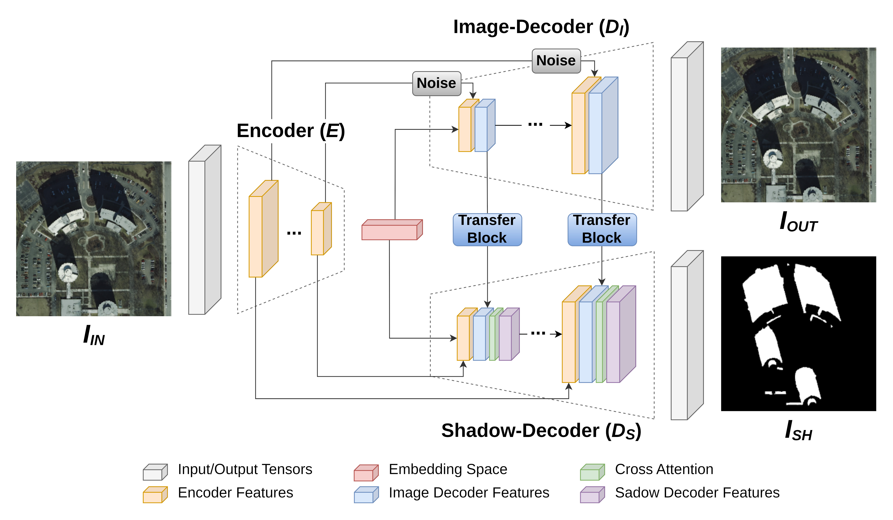

# Shadow detection using a cross-attentional dual-decoder network with self-supervised image reconstruction features

[Ruben Fernandez-Beltran](https://scholar.google.es/citations?user=pdzJmcQAAAAJ&hl=es), [Angélica Guzmán-Ponce](https://scholar.google.es/citations?hl=es&user=p5sWlAsAAAAJ), [Rafael Fernandez](https://ieeexplore.ieee.org/author/37088757738), [Jian Kang](https://github.com/jiankang1991), [Ginés García-Mateos](https://scholar.google.es/citations?user=HqyVc3oAAAAJ&hl=es)
---

This repo contains the codes for the paper: [Shadow detection using a cross-attentional dual-decoder network with self-supervised image reconstruction features](https://www.sciencedirect.com/science/article/pii/S0262885624000258). Shadow detection is a challenging problem in computer vision due to the high variability in lighting conditions, object shapes, and scene layouts. Despite the positive results achieved by some existing technologies, the problem becomes particularly challenging with complex and heterogeneous images where shadow-casting objects coexist and shadows can have different depths, scales, and morphologies. As a result, more advanced and accurate solutions are still needed to deal with this type of complexities. To address these challenges, this paper proposes a novel deep learning model, called the Cross-Attentional Dual Decoder Network (CADDN), to improve shadow detection by using fine-grained image reconstruction features. Unlike other existing methods, the CADDN uses an innovative encoder-decoder architecture with two decoder segments that work together to reconstruct the input images and their corresponding shadow masks. In this way, the features used to reconstruct the original input image can be used to support the shadow detection process itself. The proposed model also incorporates a cross-attention mechanism to weight the most relevant features for detecting shadows and skip connections with noise to improve the quality of the transferred features. The experimental results, including several benchmark image datasets and state-of-the-art detection methods, demonstrate the suitability of the presented approach for detecting shadows in computer vision applications.





## Usage

(comming soon)

<!-- `./codes/create_model_regression.m` is the proposed 3D-CNN. -->

<!-- `./codes/RUN_3dcnn.m` is a sample of the main script. -->


## Citation

```
@article{fernandez2024shadow,
  title={Shadow detection using a cross-attentional dual-decoder network with self-supervised image reconstruction features},
  author={Ruben Fernandez-Beltran and Angélica Guzmán-Ponce and Rafael Fernandez and Jian Kang and Ginés García-Mateos},
  journal={Image and Vision Computing},
  volume={},
  pages={--},
  year={2024},
  publisher={Elsevier},
  doi={10.1016/j.imavis.2024.104922}
}
```


## References

[1] Hu, X., Wang, T., Fu, C. W., Jiang, Y., Wang, Q., & Heng, P. A. (2021). Revisiting shadow detection: A new benchmark dataset for complex world. IEEE Transactions on Image Processing, 30, 1925-1934.
